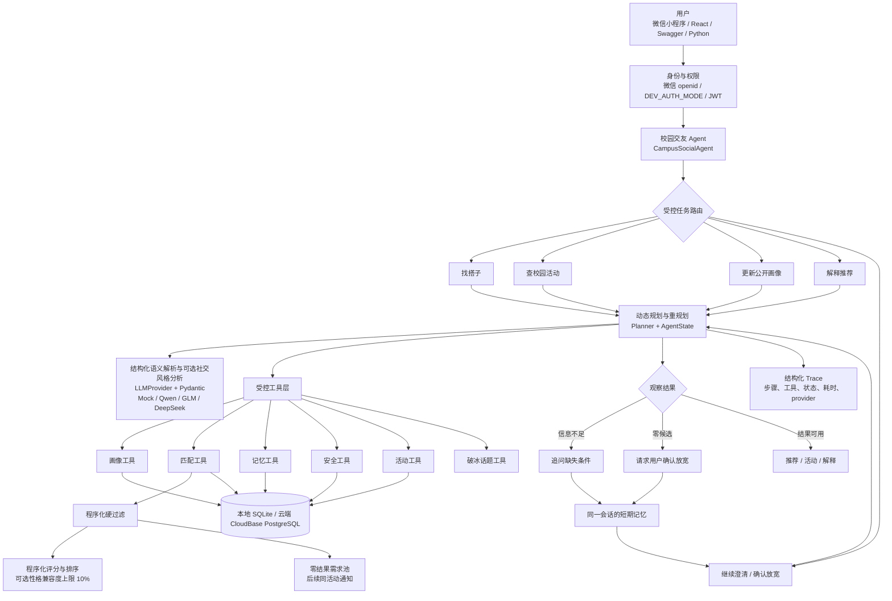

# Campus Social Agent（校园搭子 AI Agent）

一个可本地运行、可解释、可测试的校园交友 Agent MVP。用户用自然语言描述想找的学习搭子、运动搭子、兴趣伙伴或活动伙伴；Agent 负责理解目标、规划和调用工具，普通程序负责权限、硬过滤、安全规则和最终分数。

**主要前端是微信原生小程序（`miniprogram/`）**；React Web 仅作为 legacy demo 保留。后端通过 `LLM_PROVIDER=openai_compatible` 对接 Qwen、GLM、DeepSeek 等兼容服务，`LLM_PROVIDER=mock` 提供零成本本地测试。当前 CloudBase 链路已验证阿里百炼 `qwen3.7-flash`；SQLite 中提供 50 个差异化虚拟用户（全部标记 `is_mock`）和 15 个公开校园活动。

## 快速启动

要求 Python 3.10+ 和 Node.js 18+。在项目根目录执行：

```bash
./start.sh
```

脚本会自动完成 Python/前端依赖检查、Alembic 升级、幂等 Demo Seed、后端健康检查以及前后端启动。首次缺少依赖时会自动安装；按 `Ctrl+C` 会同时停止前后端。

启动后打开：

- Web：<http://127.0.0.1:5173>
- API 文档：<http://127.0.0.1:8000/docs>
- Demo 登录：`user001@ustc.edu.cn` / `CampusDemo123!`

可选环境变量：

```bash
BACKEND_PORT=8010 FRONTEND_PORT=5180 BACKEND_RELOAD=false ./start.sh
```

如果需要指定虚拟环境 Python：

```bash
PYTHON_BIN=.venv/bin/python ./start.sh
```

### 手动启动（后端）

```bash
python -m venv .venv
source .venv/bin/activate
pip install -r requirements.txt
python scripts/seed_users.py
uvicorn backend.app.main:app --reload
```

本地 `seed_users.py` 会先执行 `alembic upgrade head`，因此可以从空 SQLite 启动；它不会调用 `create_all()` 绕过迁移。`DATA_BACKEND=cloudbase_http` 时会跳过 Alembic，要求先在 CloudBase SQL 编辑器执行生成的 `deployment/cloudbase_schema.sql`。

打开：

- API 文档：<http://127.0.0.1:8000/docs>
- 健康检查：<http://127.0.0.1:8000/health>

### 微信小程序启动

1. 用微信开发者工具打开 `miniprogram/` 目录（导入项目，测试号 AppID 即可）。
2. 开发者工具默认访问 `http://127.0.0.1:8000`；API 地址集中在 `miniprogram/config.js`，也可通过 storage/ext config 运行时覆盖。
3. 首次进入会调用 `wx.login` → `POST /auth/wechat` 换取 JWT；没有真实微信环境时可在后端开启 `DEV_AUTH_MODE=true`，小程序请求不带 token 也会以 `DEV_USER_ID` 身份通过。

手机真机预览时，电脑和手机连接同一 Wi-Fi，然后执行：

```bash
LLM_PROVIDER=mock DEV_AUTH_MODE=true ./scripts/start_mobile_backend.sh
```

脚本会打印手机可访问的局域网 URL 和可直接粘贴到开发者工具控制台的 `wx.setStorageSync(...)` 命令。完整步骤与 UX 清单见 [微信小程序真机联调手册](docs/MINIPROGRAM_DEVICE_TEST.md)。

页面结构：

| 页面 | 功能 |
|---|---|
| `pages/index` | 首页入口：找搭子 / 完善画像 / 查看匹配 |
| `pages/profile` | 表单/自然语言画像 + 经明确同意的 AI 社交风格分析与删除 |
| `pages/agent` | 多轮 Chat 找搭子：Session 恢复、约束提示、快捷确认、Top 3 与破冰话题 |
| `pages/matches` | 互相匹配列表 + 待处理推荐卡片（感兴趣/跳过/不相关） |
| `pages/match-detail` | 可解释维度、社交风格摘要、推荐理由、破冰建议、拉黑/分类举报 |
| `pages/matched` | Mutual Match 展示 + 真实用户站内聊天入口（Mock 不开放） |
| `pages/chat` | Mutual Match 双方 REST 站内消息、已读与轮询 |
| `pages/notifications` | 新候选通知、活动需求暂停/重开与到期状态 |
| `pages/settings` | 通知入口、校园认证状态、推荐开关和隐私说明 |

组件：`match-card`（候选卡片）、`score-bar`（可解释分数条）、`empty-state`（空状态）。

网络层统一在 `miniprogram/services/api.js`：鉴权、401 重登、错误码和 timeout 都在这一处处理；普通接口 timeout 为 30 秒，`/agent/chat` 为 60 秒。base URL 统一由 `miniprogram/config.js` 提供。`local/public/http` 使用 `wx.request`，`cloud` 使用 `wx.cloud.callContainer`，可选 `sdk` 使用 `@cloudbase/js-sdk` v3 的 `app.callContainer()`。当前默认仍为经过验证的 `public`；只有 `local` 允许 Storage/ext-config 覆盖 API 地址。

## 封闭内测流程（5～30 人）

1. 微信公众平台注册小程序并拿到 AppID，填入后端 `.env` 的 `WECHAT_APP_ID` / `WECHAT_APP_SECRET`（只存后端）。
2. 在现有 CloudBase PG 模式环境部署云托管。当前环境不能与微信云开发关联，因此小程序通过已登记的云托管公网 HTTPS 地址和 `wx.request` 调用，不使用 `wx.cloud.callContainer`。
3. `SHOW_MOCK_USERS=true` 保持冷启动有候选；所有 Mock 用户在前端显示“测试用户”徽标，Mock 参与的 Mutual Match 会返回 `demo_match=true` 且不开放站内聊天。
4. 邀请 5～30 名同学为体验成员 → 上传体验版 → 发体验二维码。
5. 验证目标：是否愿意填画像、是否愿意自然语言描述、LIKE/PASS/NOT_RELEVANT 点击率、Mutual Match 出现率、次日留存。

逐项操作和数据口径见 [云托管部署手册](docs/CLOUDBASE_DEPLOYMENT.md) 与 [封闭内测清单](docs/CLOSED_BETA_CHECKLIST.md)。只有一个真实微信号时，可按 [单微信号双用户 E2E 验证](docs/E2E_PARTNER_LOOP.md) 用临时 non-mock B 验证需求池和新候选通知，真机确认后再执行精确清理。Phase 0～12 的真实完成边界见 [微信小程序迁移验收记录](docs/MINIPROGRAM_SPEC_ACCEPTANCE.md)。

## 如何使用 Agent

### 方式一：使用 Web 页面

1. 先启动后端和前端，然后访问 <http://127.0.0.1:5173>。
2. 使用 Demo 校内邮箱 `user001@ustc.edu.cn`、密码 `CampusDemo123!` 登录。登录后可以在“我的画像”中查看或修改昵称、简介、兴趣和空闲时间。
3. 进入“对话找搭子”，可以直接提出不同任务，例如：

   ```text
   帮我找几个周六下午可以一起打羽毛球的人，最好西区，水平休闲一点。
   西区有什么活动？
   更新画像：我最近喜欢跑步，周日下午有空。
   ```

4. 点击“发送给 Agent”。Planner 会按任务生成不同计划。信息不足时 Agent 会追问，并用同一个 `session_id` 合并下一轮回答；如果严格条件导致零候选，它只会在你明确同意后放宽对应条件。
5. 推荐卡片中可以查看共同兴趣、推荐理由、匹配分数和建议开场白；双方都主动完成社交风格分析时，性格兼容度以 10% 的有限权重参与排序。
6. 暂无同活动用户时，需求会保留 14 天；以后另一位用户也明确提出该活动，系统会给先前用户发送站内候选通知。是否放宽活动或时间始终需要明确确认。
7. 点击“感兴趣”“跳过”或“不相关”提交反馈。PASS 后该用户不会立即重复出现；只有双方都选择 LIKE/INTERESTED 才会建立 Match。
8. Mutual Match 建立后进入“我的匹配”发送站内消息。Block 会立即撤销双方聊天资格。

### 方式二：使用 Swagger API

访问 <http://127.0.0.1:8000/docs>，先调用 `POST /auth/login`：

```json
{
  "school_email": "user001@ustc.edu.cn",
  "password": "CampusDemo123!"
}
```

复制返回的 `access_token`，点击 Swagger 页面右上角 **Authorize**，粘贴 Token。然后展开 `POST /agent/recommend`，点击 **Try it out**，输入：

```json
{
  "message": "帮我找周六下午的羽毛球搭子，最好西区。",
  "limit": 3,
  "session_id": null
}
```

响应中的重要字段：

- `intent`：Agent 解析出的活动、时间、校区与软硬约束；
- `plan`：本轮实际执行的动态计划；完整推荐通常为九步，澄清、活动查询和画像更新使用更短的任务计划；
- `matches`：确定性排序后的候选、可解释分数、理由和破冰话题；每个候选直接包含 `total` 和 `features`，同时提供 `display_name`、`score`、`score_breakdown`、`match_status`（`matched`/`none`）和 `is_mock`，不是嵌套的 `score` 字段；
- `session_id`：Agent 会话 ID；下一轮把它原样传回即可继续澄清、约束协商或解释推荐；
- `safety`：消息和候选的安全检查结果。
- `response_type`：`recommendation`、`clarification`、`no_results`、`activities`、`profile_updated`、`explanation` 或 `safety_blocked`；
- `message`：面向用户的本轮说明或追问。

复制 `session_id`，调用 `GET /agent/{session_id}/trace`，即可查看每一步的 Tool、状态、耗时及输入输出摘要。Trace 只保存结构化操作记录，不保存模型隐藏思维链。

### 方式三：直接调用 Python Agent

```python
import asyncio

from backend.app.agents import CampusSocialAgent
from backend.app.database import SessionLocal


async def main():
    with SessionLocal() as db:
        result = await CampusSocialAgent(db).run(
            user_id="user001",
            message="帮我找周六下午的羽毛球搭子，最好西区。",
            limit=3,
        )
        if result["needs_clarification"]:
            result = await CampusSocialAgent(db).run(
                user_id="user001",
                message="周六下午",
                limit=3,
                session_id=result["session_id"],
            )
        print(result)


asyncio.run(main())
```

默认使用 Mock LLM，不需要 API Key。若要连接 Qwen、DeepSeek 或其他 OpenAI-compatible 服务，参考下文“LLM 配置”。

退出登录会调用 `POST /auth/logout`，服务端会递增 token 版本号并让旧 Bearer Token 立即失效。

## 中文架构图



边界是刻意设计的：LLM 只输出通过 Pydantic 验证的意图或画像；它不决定用户是否封禁、谁能看谁、Block 关系或最终 Match Score。

核心目录：

```text
backend/app/
├── agents/       # AgentState、Planner、Agent Loop、Trace
├── api/          # FastAPI routers
├── llm/          # Mock、OpenAI-compatible（Qwen/GLM/DeepSeek）与 fallback provider
├── matching/     # 检索、硬过滤、相似度、确定性评分
├── memory/       # Profile / Preference / Interaction / Session memory
├── models/       # SQLAlchemy 2 数据模型
├── schemas/      # Pydantic v2 请求、响应和 structured output
├── services/     # Feedback、Match、Block、Report、微信身份等领域规则
└── tools/        # Agent 可调用工具与公开字段白名单
frontend/         # legacy React + Vite Web Demo（本阶段不再扩展）
miniprogram/      # 微信原生小程序（主要前端）
scripts/          # 幂等 Seed 脚本
tests/            # 核心、动态 Agent、权限与端到端测试
docs/             # 架构细节和实施验收记录
```

更细的模块说明见 [架构文档](docs/ARCHITECTURE.md)，动态路由、多轮 Session、重规划和验收示例见 [动态 Agent 说明](docs/DYNAMIC_AGENT.md)，原始提示词 39 项逐项证据见 [完整验收矩阵](docs/ORIGINAL_SPEC_ACCEPTANCE.md)，完整实施过程见 [实施记录](docs/IMPLEMENTATION_RECORD.md)，2026-08-25 的复审内容见 [完善审计](docs/IMPROVEMENT_AUDIT_2026-08-25.md)。如果你想把 Codex 的续聊上下文保存在本地，请看 [Codex Continuity](docs/CODEX_CONTINUITY.md)。

## Agent Loop

`CampusSocialAgent.run(user_id, message, limit, session_id=None)` 先由 `TaskRouter` 在产品允许的任务集合中路由，再由 `Planner` 生成本轮计划。当前支持：找搭子、查活动、更新画像、解释推荐、继续澄清和确认放宽约束。

完整推荐路径仍保留透明九步：

1. `ProfileTool.load_profile`：读取发起者主动公开的画像。
2. `MemoryTool.load_memory`：读取偏好与最近反馈。
3. `LLMProvider + parse_social_intent`：生成 Pydantic `SocialIntent`。
4. `MatchingTool.search_candidates`：从真实数据库检索候选。
5. `MatchingEngine.hard_filter`：移除任何不合格候选。
6. `MatchingEngine.score_candidate`：程序计算特征和最终分数。
7. `SafetyTool`：检查消息风险信号及所有候选的安全资格。
8. 按分数确定性排序并截取 Top N。
9. `ConversationTool`：生成推荐理由对应的安全破冰话题，并写入推荐记忆。

它不是一次 `llm.chat()`，也不再是所有请求都走相同步骤的固定流水线。比如“西区有什么活动”只执行消息安全、意图解析、活动查询和响应生成；信息不全时在解析后停止并追问；硬过滤得到零候选时会观察失败原因、提出一个可解释的放宽建议，收到明确同意后才重新执行推荐。

每一步的输入和观察都会更新 `AgentState`；Tool 执行受约束能力，Session Memory 保存多轮所需的部分意图、待补字段、待确认约束和最近推荐，Trace 保存结构化操作证据。

## Agent State

`backend/app/schemas/agent.py` 中的 `AgentState` 保存：会话、用户消息、goal、intent、profile、preferences、硬/软约束、plan、tool calls、检索/过滤/排序候选、recommendations、feedback history、safety result 和 final response。

所有容器字段都使用 `Field(default_factory=...)`，没有共享 mutable default。State 是单次运行的白板，不是数据库真相来源。

## Planner

Planner 使用受控任务计划，而不是允许模型任意生成工具名。LLM 只负责产生经过 Pydantic 校验的意图或画像字段；Router 和 Planner 决定允许执行的分支。推荐过程中，Agent 可以根据“缺字段”或“零候选”观察结果替换后续步骤，这构成了有边界的动态决策。身份权限、Block、Hard Filter、Safety 和最终评分始终由程序控制。

## Tools

每个 Tool 继承 `BaseTool`，声明 `name`、`description`、Pydantic `input_schema` 和异步 `execute()`：

| Tool | 能力 | 关键边界 |
|---|---|---|
| ProfileTool | `load_profile`、`update_profile` | 仅允许白名单字段更新 |
| MatchingTool | `search_candidates`、`rank_candidates` | 只调用确定性过滤与评分引擎 |
| MemoryTool | `load_memory`、`update_memory`、记录推荐 | 持久记忆与 Session Memory 分离 |
| SafetyTool | `check_message`、`check_candidate`、`check_block` | 产生 risk signal，不永久封禁 |
| ActivityTool | 按校区/标签查找公开活动 | 不返回非公开活动 |
| ConversationTool | 破冰和共同话题 | 只使用公开画像、共同兴趣、当前需求和校区级场景 |

## Matching Algorithm

### Candidate retrieval 与 Hard Filter

SQLite 是候选事实来源，绝不把全部 Profile 交给 LLM 挑人。以下任一条件失败都会彻底移除候选：

- 本人；
- `recommendation_enabled=False`；
- 未认证；
- 任一方向存在 Block；
- 曾有 `NOT_RELEVANT`、`BLOCK` 或 `REPORT` 强拒绝；
- 明确 hard campus constraint 不满足；
- 当前请求时间完全不重合；
- 明确不兼容当前 social goal。

`PASS` 不是永久强拒绝：默认抑制 24 小时；普通推荐只抑制紧邻的上一页结果。这样相邻刷新不重复，也不会因为累计历史推荐逐渐耗尽候选池。

### Similarity 与 Score

兴趣使用无外部依赖的 Jaccard tag similarity；明确活动采用 requirement containment，因此候选包含目标活动时该维度为 1.0，不会被候选的其他活动稀释；社交目标按兼容目标集合判断。时间使用 overlap coefficient，以便“周末下午”这样的宽时间与“周六下午”合理重叠。中英文常用标签会先规范化。

```text
total = interest × 0.25
      + activity × 0.20
      + availability × 0.20
      + social_goal × 0.15
      + location × 0.10
      + feedback × 0.10
```

结果同时返回六个 0～1 特征、总分和可展示 reasons。相同总分再按用户 ID 排序，保证测试可复现。`SimilarityProvider` 接口可在以后替换为 Embedding、FAISS 或 pgvector。

## Memory

| 类型 | 存储 | 内容 |
|---|---|---|
| Profile Memory | `users` | 用户主动填写的稳定画像 |
| Preference Memory | `preferences` | 有界、移动平均更新的偏好 |
| Interaction Memory | `interactions` | 推荐、LIKE、PASS、MATCHED 等事件 |
| Session Memory | `agent_sessions` | 当前意图、待补字段、待确认约束、最近推荐与轮次 |
| Agent Trace | `agent_traces` | 带事件 ID 的结构化步骤、状态、摘要和耗时 |

`MemoryManager` 提供 `load_user_memory`、`record_feedback`、`record_recommendation`、`update_preference` 和 `get_recent_candidates`。Session 与 Trace 通过当前 Repository 持久化：本地是 SQLAlchemy/SQLite，CloudBase 是 HTTP Adapter + 事务 RPC。多个 Worker 读取同一 CloudBase PG 时可以继续会话。Session 默认使用 24 小时滑动 TTL，Trace 默认保留 7 天；过期数据会在启动和读写时清理。

Session 更新使用版本号乐观并发控制。同一 Session 的一轮执行还会取得数据库租约；如果另一个 Worker 同时处理相同 Session，API 返回 `409`，避免多轮状态交叉。Trace 使用内部事件 ID 合并陈旧写入，不会因为两个 Worker 先后保存而覆盖对方的步骤。

## Feedback 与 Mutual Match

支持 `LIKE`、`PASS`、`INTERESTED`、`MATCHED`、`CHATTED`、`MET`、`NOT_RELEVANT`、`BLOCK` 和 `REPORT`。

反馈调整以 0.5 为中性值，按时间使用 `0.85^n` 衰减并限定在 `[0.25, 0.75]`。例如 LIKE 为小幅正信号、PASS 为小幅负信号、NOT_RELEVANT 为较强但有界负信号。反馈还会把候选的公开兴趣/活动写成小幅、移动平均的 Preference Memory 信号，让相似候选获得有限调整。反馈特征只占总分 10%，其中候选直接反馈占 70%、标签偏好占 30%，一次点击不会永久扭曲推荐。

只有 A 对 B 和 B 对 A 的最新有效决策都是 LIKE/INTERESTED 才创建 `MATCHED` 记录；较新的 PASS 会撤销旧意向。Match 只开放站内聊天资格，不开放手机号、宿舍或其他私人信息。任一方 Block 后现有 Match 会转为 `BLOCKED`，聊天资格立即撤销。

封闭内测期间所有 seed/虚拟用户带 `is_mock=true`：只要 Match 双方中有 Mock 用户，反馈接口返回 `demo_match=true` 且 `chat_enabled=false`，聊天接口直接拒绝（`demo match does not open contact`），小程序端显示“测试匹配，不会开放真实联系方式”。只有真实用户之间的 Mutual Match 才开放站内聊天。

## Safety 与 Privacy

SafetyTool 检测刷单、贷款、裸照、私密照片、返利、稳赚和危险外链等信号，返回 `allow` 或 `review`。它不直接封号；处罚策略应由独立审核/治理服务决定。Block 是双向推荐不可见，Report 保存为 `PENDING` 供后续审核。

对其他用户的输出经过 `public_user()` allow-list，只包含昵称、校区、年级、专业、Bio、公开兴趣/活动/时间和社交风格。系统不包含学号、手机、身份证、宿舍或精确实时位置字段，也没有爬虫、GPS 追踪、非授权课表或自动私信。

## Database

SQLAlchemy 2 模型包括：`users`、`preferences`、`interactions`、`matches`、`messages`、`activities`、`blocks`、`reports`、`agent_sessions`、`agent_traces`、`partner_requests` 和 `notifications`。本地默认数据库是 `sqlite:///./campus_social.db`，Schema 通过 Alembic 版本化迁移；CloudBase shared-PG staging 使用 Repository/HTTP Adapter，并从同一模型 head 生成 `deployment/cloudbase_schema.sql`。

Seed 是幂等的：第一次加入 50 用户和 15 活动，再次运行显示 `added 0 users and 0 activities`，不会重复写入。`user001` 是西区研一 Demo 用户，兴趣为羽毛球、跑步和摄影。

## API

| Method | Path | 用途 |
|---|---|---|
| POST | `/auth/wechat` | 小程序 `wx.login` code 换取 JWT（openid → 内部用户） |
| POST | `/auth/login` | 校内邮箱 + 密码换取 JWT（legacy） |
| GET | `/auth/ustc/login` | 发起 USTC CAS 登录（legacy） |
| POST | `/auth/logout` | 撤销当前用户已签发的旧 Token |
| GET | `/auth/me` | 获取当前登录用户 |
| POST | `/users` | 使用允许的校内邮箱注册并创建画像（legacy） |
| GET/PATCH | `/users/me` | 读取/修改自己的画像（小程序默认入口） |
| POST | `/users/me/profile/parse` | 自然语言解析并可应用画像 |
| POST/DELETE | `/users/me/personality/analyze`、`/users/me/personality` | 经同意分析/删除有限社交风格 |
| GET/PATCH | `/users/{user_id}` | 读取/修改自己的画像（保留兼容） |
| POST | `/users/{user_id}/profile/parse` | 自然语言解析（保留兼容） |
| POST | `/agent/chat` | 对话式运行 Agent |
| POST | `/agent/recommend` | 运行推荐 Agent |
| GET | `/agent/{session_id}/trace` | 查看本 Session 的结构化动态 Trace（仅本人） |
| GET | `/matches/me` | 查看自己的 Mutual Match 和聊天资格 |
| GET | `/matches/me/{match_id}` | 查看单个匹配详情（仅参与者） |
| GET | `/matches/{user_id}` | 查看 Mutual Match（保留兼容） |
| POST | `/feedback` | 保存反馈、检测 Mutual Match、返回 demo_match |
| POST | `/block` | 建立双向不可推荐关系 |
| POST | `/report` | 提交待审核举报 |
| GET | `/activities` | 查询公开校园活动 |
| GET | `/conversations` | 查看当前用户的 Mutual Match 会话 |
| GET/POST | `/conversations/{partner_id}/messages` | 读取或发送站内消息 |
| POST | `/conversations/{partner_id}/read` | 标记对方消息已读 |
| GET/PATCH | `/partner-requests`、`/partner-requests/{request_id}` | 查看、暂停或重开找搭子需求 |
| GET/POST | `/notifications`、`/notifications/{notification_id}/read` | 查看并标记候选通知 |

请求字段和响应示例可直接在 Swagger `/docs` 中执行。更多 curl 示例见 [API 文档](docs/API.md)。

## Mock 用户

- 所有 seed/虚拟用户 `is_mock=true`，真实微信登录用户 `is_mock=false`。
- 公开输出（`public_user` allow-list）携带 `is_mock`；小程序在卡片和匹配页显示“测试用户/测试匹配”徽标。
- 冷启动由 `SHOW_MOCK_USERS=true` 控制：关闭后 Mock 用户完全不进入候选检索。
- Mock 用户参与的 Mutual Match 返回 `demo_match=true` 且不开放站内聊天（程序级强制，测试覆盖）。
- 50 个虚拟用户覆盖 3 校区、8 专业、6 年级、10 兴趣、5 时间段、4 社交目标和 4 种社交风格；`user001` 为西区研一 Demo 用户（羽毛球/跑步/摄影）。

## 环境变量

| 变量 | 默认 | 说明 |
|---|---|---|
| `APP_ENV` | `development` | `production` 时拒绝默认 JWT Secret、DEV_AUTH_MODE 和 Mock 回退 |
| `DATA_BACKEND` | `sqlite` | 本地 `sqlite`；CloudBase shared-PG staging 使用 `cloudbase_http` |
| `DATABASE_URL` | `sqlite:///./campus_social.db` | 仅本地 SQLAlchemy/SQLite 使用 |
| `CLOUDBASE_ENV_ID` | 空 | CloudBase 环境 ID，不是 Secret |
| `CLOUDBASE_API_KEY` | 空 | 后端 `service_role` API Key，只能放云托管环境变量 |
| `CLOUDBASE_PG_API_URL` | 自动生成 | 可选覆盖；默认 `https://<envId>.api.tcloudbasegateway.com/v1/rdb/rest` |
| `LLM_PROVIDER` | `mock` | `openai_compatible` / `deepseek` / `qwen` / `mock` |
| `LLM_BASE_URL` | 空 | Qwen/GLM/DeepSeek 的 OpenAI-compatible 地址 |
| `LLM_API_KEY` | 空 | 只存后端，不进 Git/小程序/日志 |
| `LLM_MODEL` | 空 | CloudBase 当前已验证 `qwen3.7-flash`；本地按所选 Provider 填写 |
| `LLM_RESPONSE_FORMAT` | `auto` | GLM/DeepSeek Chat 自动使用 `json_object`，其他兼容端默认 `json_schema` |
| `REQUIRE_CAMPUS_VERIFICATION` | `false` | `true` 时未认证账号只能维护画像，不能使用 Agent/匹配/聊天等社交功能 |
| `LLM_FALLBACK_TO_MOCK` | `true` | 真实 provider 失败时回退 Mock；生产禁止 |
| `OUTBOUND_HTTP_TRUST_ENV` | `false` | LLM/微信请求是否继承宿主代理；代理 URL 应使用 `http://` 或 `socks5://` |
| `DEV_AUTH_MODE` | `false` | 本地免 token 身份（仅非生产） |
| `DEV_USER_ID` | `user001` | dev 模式固定身份 |
| `SHOW_MOCK_USERS` | `true` | 控制候选检索是否包含 Mock 用户 |
| `ALLOW_MOCK_VERIFICATION` | `true` | 允许 Mock 认证（内测） |
| `WECHAT_APP_ID` / `WECHAT_APP_SECRET` | 空 | 微信身份，只存后端 |
| `JWT_SECRET` 等 | 见 `.env.example` | JWT 签发配置 |
| `DEBUG_AGENT_TRACE` | `true` | 打开 Agent Trace 记录 |

## 部署抽象

后端不绑定任何云厂商 SDK：

- 本地：`uvicorn backend.app.main:app`（SQLite）。
- 容器：`Dockerfile`（迁移 + Seed + uvicorn 一体，`PORT` 可配）。
- Serverless/HTTP Function：`app = FastAPI(...)` 是标准 ASGI 入口，任何 ASGI 适配器可直接挂载。
- 数据库：本地为 SQLAlchemy/SQLite；CloudBase shared-PG 通过 PostgREST Repository Adapter，简单 CRUD 走表 REST，事务写入走数据库函数 RPC。
- 小程序：所有网络请求走 `miniprogram/services/api.js`；体验版默认使用 `API_MODE=sdk`，通过 `@cloudbase/js-sdk` v3 的匿名 OAuth session + `app.callContainer()` 访问 CloudBase Gateway。校园搭子业务身份仍是 `wx.login → /auth/wechat → FastAPI JWT`，并由 `X-Campus-Authorization` 携带。历史 `apiMode` / `apiBaseUrl` Storage 不能覆盖发布 transport；`public/http`、`local`、`cloud` 仍保留作为回退和开发模式。

## 0 元封闭内测策略

“0 元”指开发和 5～30 人封闭测试阶段尽量不产生费用，不假设任何平台永久免费：

1. 数据库用本地 SQLite（开发）/ 当前 CloudBase shared-PG 的 HTTP API（staging），不需要数据库公网地址或独享集群。
2. 零成本本地链路使用 Mock LLM；云端模型费用以提供商控制台当期额度/计费为准，正式内测建议 `LLM_FALLBACK_TO_MOCK=false`，避免静默改变体验。
3. 云端优先使用微信云开发云托管容器；开通前以控制台当天显示的免费额度、休眠、流量和构建计费为准。
4. 不购买：云服务器、域名、Redis、消息队列、向量数据库。
5. 免费体验有额度和休眠风险；部署仍由标准容器、SQLAlchemy URL 和环境变量抽象。

## Demo

```bash
curl -X POST http://127.0.0.1:8000/agent/recommend \
  -H 'Content-Type: application/json' \
  -H 'Authorization: Bearer <登录返回的 access_token>' \
  -d '{
    "message": "帮我找几个周六下午可以一起打羽毛球的人，最好西区，水平休闲一点。",
    "limit": 3
  }'
```

2026-08-26 在全新隔离数据库中的实际验收前三名是阿青（0.8667）、小林（0.8250）和同学47（0.7417），三人都在西区且周六下午有空。返回还包含 9 步 plan、六维 `features`、`reasons`、`icebreaker`、session ID 和 safety result；候选没有泄漏任何后台认证字段。

2026-08-27 微信迁移版端到端实测（`DEV_AUTH_MODE=true` + Mock LLM + 全新临时数据库）：

```text
POST /agent/chat "帮我找几个周六下午可以一起打羽毛球的人，最好西区，水平休闲一点。"
→ goal: find_activity_partner, plan: 9 步
→ matches: 阿青 0.8667 | 小林 0.825 | 同学47 0.7417（is_mock 均为 true）
→ suggested_icebreakers: 3 条
→ trace: load_profile → load_memory → parse_intent(mock) → search_candidates
         → hard_filter → score_candidates → safety_check → rank_candidates
         → generate_recommendation，全部 success

POST /feedback {"candidate_id":"user003","feedback":"PASS"}      → recorded
POST /feedback {"candidate_id":"user002","feedback":"LIKE"}      → matched=false
user002 LIKE user001（带 token 模拟对方）                          → matched=true,
                                                                   demo_match=true,
                                                                   chat_enabled=false
GET  /matches/me                                                  → 1 条匹配,
                                                                   partner=小林,
                                                                   demo_match=true
POST /users/me/profile/parse "我研一，喜欢跑步和摄影…"             → grade=研一,
                                                                   interests=[跑步,摄影]
POST /block {"blocked_user_id":"user002"}                         → blocked
再次推荐                                                           → user002/user003
                                                                   均不再出现
```

Feedback Demo：

```bash
curl -X POST http://127.0.0.1:8000/feedback \
  -H 'Content-Type: application/json' \
  -H 'Authorization: Bearer <登录返回的 access_token>' \
  -d '{"candidate_id":"user003","feedback":"PASS"}'
```

重新推荐时 `user003` 不会立即出现，排序会使用剩余候选。自动化测试覆盖了这一完整过程。

## Tests

```bash
python -m pytest -v
ruff check backend scripts tests
python -m compileall -q backend scripts
cd frontend && npm run build
```

当前本地自动化验收基线：`132 passed, 3 skipped`（skip 为需显式启用并会调用真实 Provider 的集成测试）。覆盖认证、JWT、微信身份、校园认证边界、密码哈希、Alembic SQLite Fresh/Legacy 迁移、真实 PostgreSQL 0008→0009 数据保留升级、CloudBase HTTP Adapter/RPC 路由、需求池与候选通知、可撤销性格分析、可选性格兼容评分、聊天权限、结构化举报、Mock 用户标记与过滤、`/users/me`、`/matches/me`、Mutual Match、Profile/Intent Parser、Matching Score、Hard Filter、Block、Feedback、持久化 Session/Trace、动态 Planner、Mini Program `wx.request`/`callContainer` transport 契约、API 和 End-to-End。

- `test_blocked_users_never_match`
- `test_same_interest_and_time_get_higher_score`
- `test_mutual_like_creates_match`
- `test_client_cannot_impersonate_arbitrary_user`
- `test_demo_match_between_mock_users_does_not_open_contact`
- `test_dev_auth_resolves_configured_user` / `test_dev_auth_rejected_in_production`
- `test_wechat_login_creates_and_reuses_stub_user`
- `test_mock_user_flag_is_exposed_in_public_schema` / `test_show_mock_users_hides_mock_candidates`
- `test_matches_me_lists_only_own_matches`（含 `/matches/me/{match_id}` 越权 403）
- `test_agent_response_exposes_score_fields_before_match`（响应含 `display_name`/`score`/`score_breakdown`/`match_status`）
- PASS 后不立即重复的端到端测试
- Mutual Match 必须双向意向的测试
- 跨数据库 Session 恢复多轮 Agent 的测试
- 多 Worker Session 租约与陈旧 Trace 合并测试
- Session/Trace TTL 过期清理测试
- 未认证用户无法登录或进入候选、客户端不能伪造 `verified`、公开输出不泄漏认证字段的测试
- Tool 完整能力测试：画像更新白名单、公开活动过滤、Block 检查和共同话题生成

## LLM 配置

复制配置：

```bash
cp .env.example .env
```

应用启动时会读取当前项目的 `.env`，也接受系统环境变量或进程管理器注入。默认 `LLM_PROVIDER=mock`，不需要 API Key。当前已验证的 GLM 配置形式为：

```text
LLM_PROVIDER=openai_compatible
LLM_BASE_URL=<OpenAI-compatible 网关的 v1 地址>
LLM_API_KEY=<只存后端>
LLM_MODEL=glm-5.3-flash
LLM_RESPONSE_FORMAT=auto
```

接 DeepSeek 时设置：

```text
LLM_PROVIDER=openai_compatible
LLM_BASE_URL=https://api.deepseek.com
LLM_API_KEY=sk-你的key
LLM_MODEL=deepseek-chat
LLM_RESPONSE_FORMAT=auto
```

注意：

- API Key 只存在后端 `.env`，不进 Git、不进小程序源码、不写日志。
- 如果 Key 无效，开发环境会自动回退到 Mock 解析器并在 Trace 中把 provider 标记为 `openai_compatible:fallback`，接口不会 500；生产环境禁止回退并返回经过清洗的 503，不透出上游 Key/响应内容。
- 想验证真实 Provider 连通性：`RUN_LLM_INTEGRATION=1 python -m pytest tests/test_llm_integration.py -v`（会消耗少量额度）。2026-08-28 已用当前 `.env` 真实跑通 `glm-5.3-flash` structured output 和完整 9 步 Agent，Trace provider 为 `openai_compatible`，没有 Mock fallback。

Adapter 调用 `/chat/completions`：`LLM_RESPONSE_FORMAT=auto` 会为 DeepSeek、GLM 选择 `json_object` 并在 system prompt 注入完整结构约束，为其他 OpenAI-compatible 地址选择 `json_schema`。模型名识别保证 GLM 经过机构自定义网关时仍使用正确协议。不同厂商的兼容差异只封装在 Adapter 内，不修改 Agent、Tool 或 Matching。参见 [GLM 结构化输出](https://docs.bigmodel.cn/cn/guide/capabilities/struct-output) 和 [DeepSeek JSON Output](https://api-docs.deepseek.com/guides/json_mode/)。

## 认证配置

三种身份路径：

1. **微信小程序（主要）**：`wx.login` 得到 `code` → `POST /auth/wechat` → 后端调 `jscode2session` 换 `openid` → 首次登录创建 `wx-` 开头的内部用户并签发 JWT。`wechat_openid` 唯一且可空（seed 用户没有 openid）。
2. **本地开发**：`DEV_AUTH_MODE=true` + `DEV_USER_ID=user001`，不带 token 的请求固定以 dev 身份通过；带有效 token 的请求仍按 token 身份处理（便于本地模拟多用户）。`APP_ENV=production` 时启动直接拒绝该配置。
3. **Web/邮件（legacy）**：校内邮箱 + 密码或 USTC CAS，保留用于已有测试与管理。

Demo Seed 用户统一使用密码 `CampusDemo123!`。注册用户的密码使用随机盐 scrypt 哈希，数据库不保存明文。JWT 使用固定允许的 `HS256`，包含并校验 `sub`、`iat`、`exp`、`iss` 和 Token 类型。

```text
JWT_SECRET=change-this-development-secret-at-least-32-bytes
JWT_ACCESS_TOKEN_MINUTES=120
JWT_ISSUER=campus-social-agent
```

开发默认 Secret 只用于本地 Demo；`APP_ENV=production` 时应用会拒绝使用默认 Secret 启动。登出通过递增 `token_version` 让旧 Access Token 立即失效；当前没有 Refresh Token 轮换，生产化前仍需补齐集中式撤销、密钥轮换和多服务一致性。

## 当前 Mock

- 微信身份第一版已实现（jscode2session + openid 映射内部用户）；小程序真机登录需要真实 AppID/Secret 与后端公网地址，本环境未真机验证。
- `MockLLMProvider` 是确定性中文关键词解析器；`OpenAICompatibleProvider` 已在 CloudBase 链路跑通阿里百炼 `qwen3.7-flash`，也兼容 GLM/DeepSeek，开发环境失败可选择回退并标记 `provider=:fallback`。
- 50 个用户和 15 个活动均为虚拟数据，全部 `is_mock=true`，前端显示“测试用户/测试匹配”。
- Mock 用户参与的 Mutual Match 不开放站内聊天（程序级强制）。
- 站内聊天仅对真实用户之间的 Mutual Match 开放，支持持久化 REST 消息、未读数和安全检查，但没有 WebSocket 实时推送。
- Session Memory 和 Trace 已持久化；本地 SQLite 适合 Demo，CloudBase staging 通过 shared-PG HTTP API 支持重启和多 Worker 共享。
- Safety 是关键词/外链 risk signal，没有自动处罚和人工审核后台。

## 部署

```bash
docker build -t campus-social-agent .
docker run -p 8000:8000 --env-file .env campus-social-agent
```

生成云托管包和可导入微信开发者工具的小程序源码包：

```bash
./scripts/package_cloudbase.sh
./scripts/package_miniprogram.sh
```

容器启动会自动执行初始化检查 + 幂等 Seed，再启动 uvicorn。本地 `DATA_BACKEND=sqlite` 时执行 Alembic；CloudBase staging 使用 `DATA_BACKEND=cloudbase_http`，Schema 先在控制台执行 `deployment/cloudbase_schema.sql`，运行期只访问 PostgREST。小程序当前通过云托管公网 HTTPS + `wx.request` 访问 FastAPI。

2026-08-28 已实际完成 Docker build/run、容器健康检查、非 root 用户检查和真实 HTTP 推荐冒烟；CloudBase 初始化 SQL还在 PostgreSQL 16 上验证了事务函数与服务角色门禁。当前 shared-PG 环境步骤见 [云托管部署手册](docs/CLOUDBASE_DEPLOYMENT.md)。

## 已知限制

- CloudBase 云托管 `campus-social-agent` 版本 002、健康探针、shared-PG Seed 与 `/agent/chat` 已实际跑通；本轮 0009 Schema 和新版本仍需要按部署手册发布后做一次真机回归。
- 微信登录链路已实现；校园认证与微信账号的产品化绑定入口尚未完成，因此当前内测保持 `REQUIRE_CAMPUS_VERIFICATION=false`。启用强制校验前必须先让体验用户可完成绑定。
- 站内聊天无实时推送（无 WebSocket）；Mock 用户之间按设计不开放聊天。
- 认证无 Refresh Token 轮换；无集中式撤销与人工审核后台。
- 单机 SQLite 仅用于本地开发；云端统一使用 CloudBase PostgreSQL。

## Future Roadmap

最值得优先开发的三个功能：

1. 校园身份绑定与治理后台：让微信账号完成 CAS/校邮绑定，再开启强制校园认证；提供举报审核、处置与申诉记录。
2. 实时体验与可观察性：WebSocket/订阅消息、限流，以及服务端 P95、错误率、LLM fallback 和 Session 冲突指标；当前可先用 `python scripts/beta_metrics.py` 查看聚合产品指标。
3. 可解释语义召回：积累匿名化标注集后，在 Hard Filter 后评估中文 Embedding/pgvector；达到离线指标后再逐步替换 tag 召回，并持续保留程序化评分和性格分析 10% 上限。
