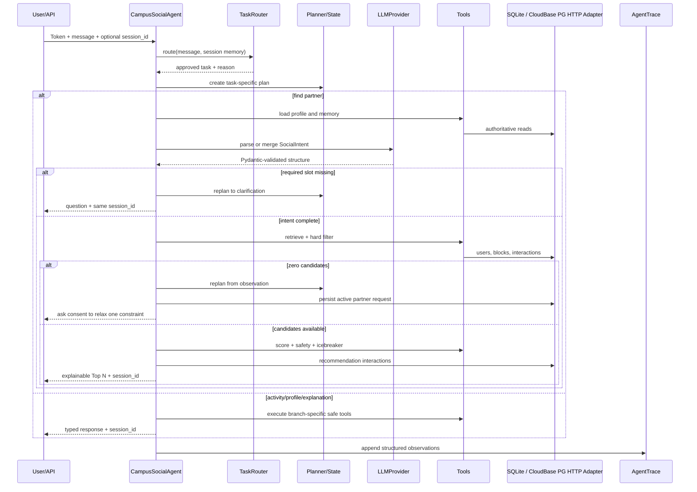

# 架构与核心设计细节

## 1. 责任边界

Agent 层拥有意图理解、Goal、Plan、Tool Selection/Execution、Observation、推荐解释、Memory 和 Feedback Loop。数据库与确定性程序拥有认证状态、Block、可见性、隐私字段、Hard Filter、最终分数和 Safety 规则。

这条边界有两个直接效果：相同数据和意图得到可复现排名；即使替换 LLM Provider，也不会绕过封禁或读取不允许公开的字段。

## 2. 动态 Agent 数据流

同一个 Session 的后续轮次会在已有 Trace 后继续编号，因此可以还原“追问 → 回答 → 推荐”或“零候选 → 用户确认 → 重试”的实际动作序列。Trace 不保存 prompt 的隐含推理或模型 chain-of-thought。每项只包含 step、action、tool、输入/输出摘要、status 和 duration。输入摘要只保存长度、键名或数量。

## 3. 受控自主性

当前设计刻意选择 bounded agent，而不是开放式 ReAct：

- `TaskRouter` 只允许找搭子、查活动、更新画像、解释推荐、继续澄清和确认放宽约束；
- `Planner` 为不同任务产生不同 action allow-list，并只在明确观察点重规划；
- `LLMProvider` 只能返回 `SocialIntent` 或 `ProfileParseResult` 等结构化数据；
- Tool 输入继续经过 Pydantic 校验，画像更新受字段白名单限制；
- 放宽硬约束必须有用户明确确认，Agent 不会自行删除条件；
- 权限、Block、Hard Filter、Safety 和最终排序不由模型决定。

这种设计已经具备 Agent 的任务路由、状态、观察、重规划、工具使用、多轮记忆和可观察性，同时保持校园交友场景需要的安全可审计边界。

## 4. 数据模型

- `User`：公开校园画像、推荐开关、后台认证标记。
- `User.personality_*`：用户明确同意后保存的有限社交风格标签和温和摘要；不保存分析原文。
- `Preference`：按 `(user_id, key)` 唯一的有界偏好权重。
- `Interaction`：事件流，包括 RECOMMENDED 和全部 Feedback。
- `Match`：排序后的用户对唯一，只有 Mutual Interest 后写入。
- `Block`：有方向的操作记录，读取规则按双向不可见解释。
- `Report`：举报原因和 PENDING 状态，不直接触发永久处罚。
- `PartnerRequest`：按 Agent Session 保存两周有效的找搭子需求，支持 OPEN/PAUSED/FULFILLED/EXPIRED。
- `Notification`：陌生活动后来出现候选等站内提醒，只保存最小结构化 payload。
- `Activity`：仅公开的 Mock 校园活动。
- `Message`：仅 Mutual Match 双方可访问的站内消息、安全检查结果与已读时间。

JSON 列用于 MVP 的标签列表；本地由 SQLite JSON、CloudBase staging 由 PostgreSQL JSON 承载。CloudBase shared-PG 不提供协议直连时，Repository Adapter 将简单读写翻译为 PostgREST，并把需要事务的写入交给数据库函数。以后若需要高并发筛选与统计，可规范化为关联表或迁移 PostgreSQL JSONB/数组，但领域接口不需要变化。

## 5. Matching 的可解释性

`filters.py` 每个失败项返回稳定 reason code；`scorer.py` 返回每个特征值和中文理由；`engine.py` 只负责检索、过滤、特征计算和稳定排序。三者分别可做单元测试。

Jaccard 适合小规模自报标签，缺点是不能识别“羽球”和“羽毛球”之外的开放语义。MVP 用显式 alias 映射解决常见中英标签，未来实现 `SimilarityProvider` 时应建立离线标注集，比较 Recall@K、NDCG、Block 泄漏率和解释一致性。

活动请求默认先做活动标签精确匹配；没有同活动用户时写入等待池，只有用户明确同意才把活动放宽为相近偏好。后来另一位用户主动提出相同活动时，先前请求者会收到站内通知。性格兼容度仅在双方都主动同意并拥有结构化标签时占最终分数 10%；任一方缺失时沿用原六维总分，不把模型推断变成 Hard Filter。

## 6. Feedback Loop

Feedback 先作为不可变 `Interaction` 保存。候选级信号从新到旧聚合，后续同目标反馈乘 `0.85^n`；同时将候选公开兴趣和活动学习为幅度不超过 0.25 的 `Preference` 移动平均。排序的 feedback 特征由 70% 候选直接信号与 30% 标签偏好组成，最后仍截断到 `[0.25, 0.75]`。这样历史可审计、相似候选可以获得有限泛化，也不会把一次点击直接写死到用户画像。

近期候选是另一条独立机制：24 小时内的 PASS 与紧邻的上一推荐页会临时从检索结果排除。只抑制上一页而不是固定“历史最后 N 人”，可避免连续刷新重复，也不会逐步耗尽候选池。`NOT_RELEVANT`、BLOCK、REPORT 属于强拒绝，Hard Filter 永久排除，除非未来提供显式撤销流程。

## 7. Safety、Block 与 Report

SafetyTool 是风险探测器，返回信号但没有修改认证/封禁字段的能力。外链使用解析后的 hostname 精确校验，避免 `campus.example.evil.test` 这类前缀伪装。Block 是用户明确操作，产生方向记录并按任一方向阻止推荐；若双方已有 Match，会改为 `BLOCKED` 并撤销聊天资格。Report 使用骚扰、诈骗、虚假身份、不当内容或其他结构化类别并保留文字说明；它是待审核案件，同时作为发起者对目标的强拒绝，避免举报后继续推荐。

生产化时建议拆成：实时消息分类器、策略引擎、案件系统和处罚执行器。永久处罚必须有证据、策略版本、人工复核和申诉路径。

## 8. Provider 与扩展点

`LLMProvider.structured(prompt, output_schema)` 是唯一模型边界。Mock 用于开发/测试；OpenAI-compatible Adapter 使用标准 HTTP API。扩展厂商兼容、重试、超时、熔断和使用量记录时只修改 `llm/`。

类似地，Similarity 和数据 Repository 都有清晰替换点。Session 与 Trace 在本地由 SQLAlchemy 持久化，在 CloudBase 由 HTTP Adapter/RPC 持久化，切换时不改变 Agent API。MVP 不引入 LangChain、大型 Embedding、Kafka、Redis 或多 Agent。

## 9. 已知局限

- SQLite 可验证服务重启和多进程共享，但不适合生产高写入并发；多 Worker 部署建议使用 PostgreSQL。
- Tag 解析、时间规范化和 Safety 关键词覆盖有限。
- API 已使用 HS256 JWT 和对象级权限，从 Token 推导当前用户，不信任请求体中的 `user_id`。
- Access Token 已带 `token_version` 并支持登出立即撤销旧 Token，但还没有 Refresh Token 轮换和集中式跨服务撤销存储。
- 已支持 USTC CAS 和校内邮箱身份字段；本地密码登录仍是 Demo/开发路径，生产部署需要完成真实 CAS 配置、回调域名和运维密钥管理。
- Session 使用滑动 TTL、乐观版本和数据库轮次租约；Trace 使用 TTL、条目上限和事件 ID 合并。当前过期清理由启动与读写触发，大规模部署应增加独立周期清理任务。
- 应用启动不再用 `create_all()` 隐式改变 Schema，而是校验持久化表和租约列；Schema 演进以 Alembic head 为唯一来源。
- REST 聊天已经受 Mutual Match、Block 和 Safety 约束，但没有 WebSocket 实时推送、消息加密或治理后台。
